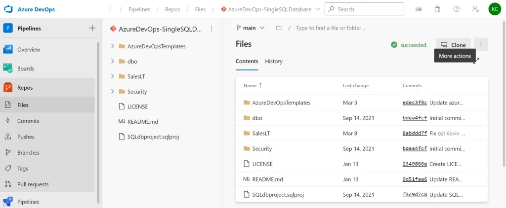

### Azure Devops

* Azure Devops was earlier called as Visual Studio Team Services

* Azure DevOps is an end-to-end software development platform that offers an assortment of capabilities intended to organize and accelerate development efforts across the entire application lifecycle.

    * Refer here for more info

* Azure DevOps offers servies to
    * manage agile projects
    * test management
    * Pipelines
* Features of Azure DevOps
   *  Management:
        * Azure Boards
        * Agile Management
    * Testers:
        * Test Management
    * DevOps:
        * Pipelines
    * Developer:
        * Version Control System

    * Azure DevOps setup
        * Azure DevOps Server:
            We need to install this on Windows Servers
        * Azure DevOps Services
            This is already hosted. We can create account using
            * GitHub
            * Microsoft Account
        * Plans
* DevOps pipeline High level overview
    * Why do we need to do Continuous Integrations?
    * We do integrations multiple times in a day from day 1 of the project so that we can avoid surpirses during big bang integrations.
    * To perform automated integrations we need tools
        * build/package the code
        * run the tests
        * evaluate the test results
* The idea is perform continuous integration for almost every change submitted by developer(s)
* Open Questions- To be discussed tomorrow:
    * What are the tests that need to be executed?
    * How can code written by developers improved ?

Refer here for practice
https://azuredevopslabs.com/

Azure Boards:
-------------
 * Azure boards can be used to plan, track and discuss work across teams using the Agile planning tools that are available.
 * Using Azure Boards, teams can manage their software products.
 * It also offers a unique set of capabilities, including native
support for Scrum and Kanban.
* You can also create customizable dashboards,
and it offers integrated reporting and integration with Microsoft Teams and Slack.
* You can create and track user stories, backlog items, tasks, features, and bugs
that are associated with the project using Azure Boards.

Azure Repos:
------------
* Azure Repos provides support for private Git repository hosting and for Team Foundation Server Control (TFSC).
* It offers a set of version control tools that can be used to manage the source code of every development project, large or small.
* Today Git is the most popular tool for version control systems. By default Azure Devops offers standard Git so that developers can use the tools and client of their choice.

Azure Pipelines:
----------------
* You can use Azure Pipelines to automatically build, test, and deploy code to make it available to other users and deploy it to different targets, such as a development, test, acceptance, and production (DTAP) environment. It combines CI/CD to automatically build and deploy your code.

