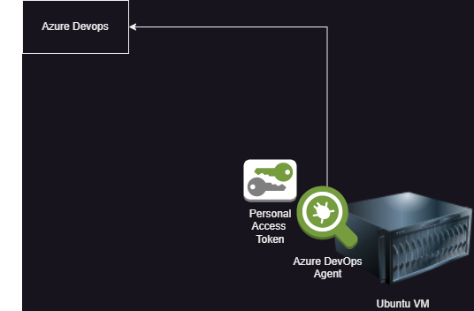

Configuring Self Hosted Agent in Azure Devops
----------------------------------------------
* Self Hosted Agent is linux/ Windows/ Mac instance managed by us.
* Lets create a ubuntu linux VM


* To run your jobs, you'll need at least one agent. A Linux agent can build and deploy different kinds of apps, including Java and Android apps. 
* We will install an agent on our VM and that agent will speak to Azure Devops.
* To do that we need to generate PAT(Personal Access Token)
* This is called agent in Azure devops, in Jenkins it is called as Node and in git lab it is called as runner.
* There are some prerequisites to install an agent
    * The agent is based on .NET 6. You can run this agent on several Linux distributions. 
    * Git - Regardless of your platform, you will need to install Git 2.9.0 or higher. We strongly recommend installing the latest version of Git.
* Let us create a virtual machine in AWS with name as AzureDevops, OS as ubuntu.  
* Install Java, Maven in that VM.
* Click on Project Settings. You can see an option called Agent pools.
* To Maintain collection of agents, Azure has agent pools. By default we have two pools
    * default : for self hosted agents
    * Azure pipelines: for microsoft hosted agents.
* Click on New Agent
    * select linux and download the agent into tmp folder in linux machine.
* Create a PAT by clicking on user settings and personal access tokens, new token and give full access.
* Create a directory called my agent and get into that 
    `mkdir myagent && cd myagent`
    `tar -xvzf /tmp/vsts-agent-linux-x64-3.227.2.tar.gz`
    `ls`
* Configure the agent
    `~/myagent$ ./config.sh`
    * Do you want to accept the license agreement press Y
    * Server URL - `https://dev.azure.com/organizationName`
    * Enter authentication type - press Enter
    * Enter personal access token - give the PAT generated
    * After connecting to server 
    * Enter agent pool
    * Enter agent name
    * Enter work folder (press for _work)
    * After settings are saved, you want to run this. There are two ways to run.
        * ./run.sh 
        * ./run.sh --once -- runs only once.
        * run as systemd service -- runs all the time
    * As long as this script is running the agent is connected to the server, otherwise it will be offline. To be always connected run the script as service or make it a daemon.
    

* Azure pipelines are represented in YAML format. YAML is used as a data representation format.
* YAML is a name value pair collection.
    * <name>: <value>
* Value holds data and types of data are
    * Simple/Scalar
        * text: course: AzureDevOps or course: "AzureDevOps" or course: 'AzureDevOps'
        * number: duration: 120
        * boolean online: yes or online: true
    * Complex
        * list/array/plural
            ```yaml 
            tools:
              - git
              - maven
              - sonarqube
              - jfrog
            ``` 
        * object/map/dictionary
            ```yaml
            address:
            flat: 407
            building: mytrivanam
            street: ameerpet main road
            area: ameerpet
            landmark: metro
            pincode: 500016
            ```
* Sample YAML
    ```yaml
    contact:
    mobile: 9999999
    email: info@qt.in
    CareerObjective: |
        A motivated individual with in-depth knowledge of languages 
    and development tools, seeking a position in a growth-oriented 
    company where I can use my skills to the advantage of the 
    company while having the scope to develop my own skills.
    ExpertiseAreas:
        - Project Management
        - DevOps
    WorkExperience:
        - organization: Radiant Spark
        duration: 03/2014 - present
        designation: senior software engineer
        randr:
            - Eat healthy
            - Drink every night
            - sleep on time
        - organization: Technet
        duration: 03/2011 - 02/2014
    ```
