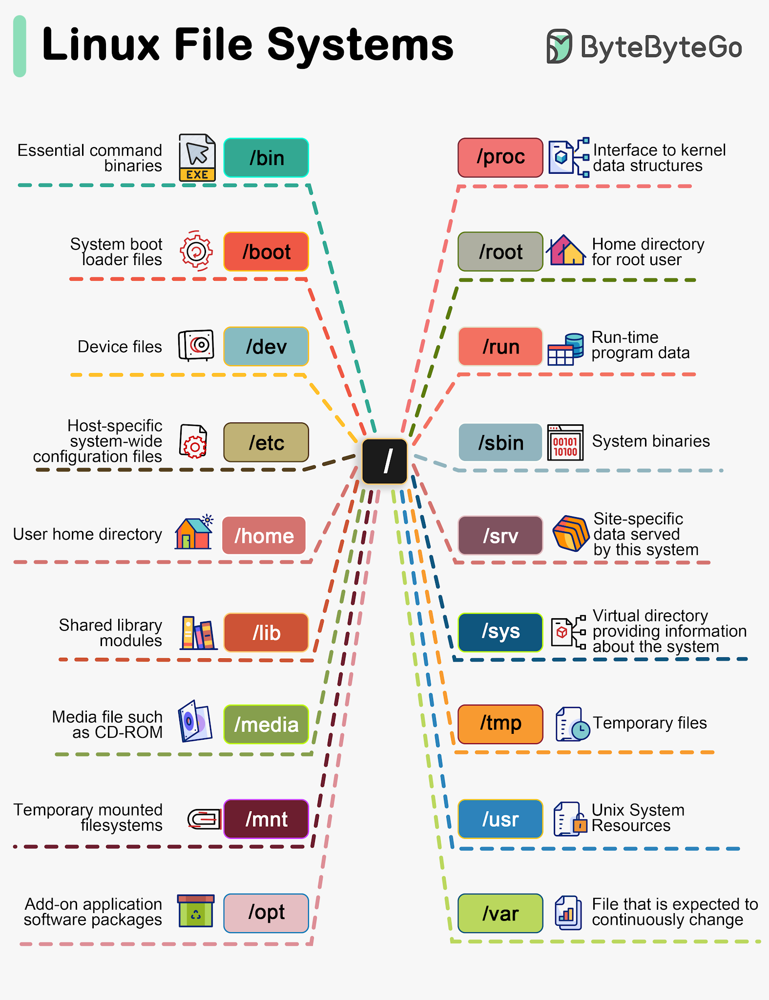

* Linux is the best-known and most-used open source operating system.
* Linux was created in 1991 by Linus Torvalds, a then-student at the University of Helsinki. Torvalds built Linux as a free and open source 

